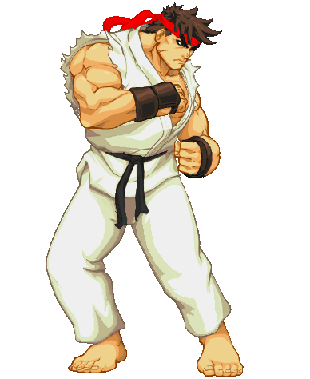

# Hadouken

## This simple project is part of the [gomycode](https://gomycode.tn) fullstack JS cursus.

## User Stories

1. <strong>User Story:</strong> The user need to interact with the image by hovering over it and clicking on it with the mouse to see the animation.

### A simple animation of ryu doing his famous hadouken move using jquery.

	

# What did I learn:

1. DOM manipulation using Jquery.

2. Jquery's basics.
